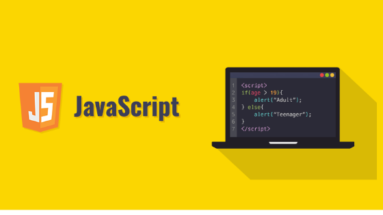

 # Learn JavaScript With in 30 Days

Welcome to the **Learn JavaScript With in 30 Days** repository! This comprehensive guide is designed to help you master the fundamentals of JavaScript programming in just 30 days. Whether you're a beginner looking to learn your first programming language or an experienced developer seeking to expand your skill set, this repository has got you covered.

## Contents
- [Introduction](#introduction)
- [Features](#features)
- [Getting Started](#getting-started)

## Introduction
JavaScript is a powerful and versatile programming language widely used for web development. With its ability to create interactive and dynamic web pages, JavaScript has become a must-know language for aspiring developers. This repository aims to provide a structured and accessible approach to learning JavaScript, enabling you to build a strong foundation and confidence in your programming skills.

## Features
- **30-Day Learning Plan**: This repository offers a day-by-day learning plan, covering various JavaScript concepts and techniques. Each day's content includes explanations, code examples, and exercises to reinforce your understanding.
- **Clear Explanations**: The content is presented in a beginner-friendly and easy-to-understand manner, making it suitable for learners at all levels.
- **Code Examples**: Numerous code examples are included, demonstrating JavaScript concepts and best practices.
- **Additional Resources**: Supplementary resources, such as recommended books, online tutorials, and useful websites, are provided to further enhance your learning journey.

## Getting Started
To get started with learning JavaScript using this repository, follow these steps:
1. Clone or download this repository to your local machine.(https://github.com/lijnati/Learn-JavaScript-with-in-30-Days.git)
2. Navigate to the repository's directory and explore the course materials.
3. Start with Day 1 and follow the daily progression as outlined in the course structure.

